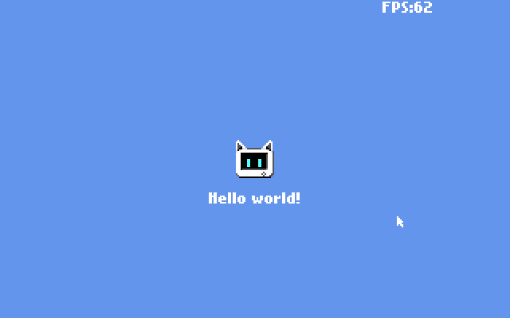
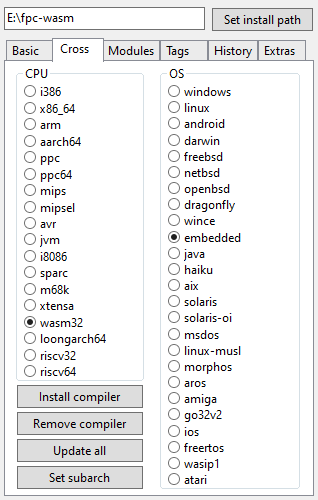

#



This project is a port of [POSIT-92](https://github.com/Hevanafa/POSIT-92) which targets WebAssembly

## Requirements

1. **Free Pascal Compiler** which has been configured with `wasm32-embedded` as the target (read **Compiler Setup** section below to see how)
2. **VSCode** with the **[OmniPascal](https://marketplace.visualstudio.com/items?itemName=Wosi.omnipascal)** extension by Wosi enabled
3. Any version of **Node.js** to start the `http-server`
4. Optional: **PowerShell 7** installed ([WinGet](https://learn.microsoft.com/en-us/powershell/scripting/install/install-powershell-on-windows?view=powershell-7.5#winget))
   - This is only necessary if you want to run any build scripts from outside VSCode

I'm using Windows 10 Home (64-bit, version 22H2, build 19045.6575) to build this project

If you want to use **Bun** to handle the build scripts instead of PowerShell, install the dependencies first with

```powershell
bun install
```

**Update 11-12-2025:** Changed the extension used

This is because the **Pascal** extension by Alessandro Fragnani is too difficult to get the "Go to definition" feature working, while **OmniPascal** can do it right out of the box

OmniPascal has a built-in code navigation, so it doesn't require GTags/CTags, GNU Global, or even Python installed

**Planned:** PowerShell scripts will be rewritten with Bun with TypeScript, skipping the need to install Node.js and PowerShell 7

## Getting Started

1. Open **PowerShell 7**
2. cd to `boilerplate`
3. Run `bun .\setup.ts; .\compile.ts`

   This will make sure that all the units can be compiled & run

4. Copy all the contents of the `boilerplate` folder except for `setup.ts` to your new project

## Build Scripts

I have prepared a few scripts to ease the build process

- `build_run.ts` - Build & run
- `run.ts` - Run without building

- `compile.ts` - Contains the command line to automatically delete the output file & compile the WebAssembly binary
- `start_server.ts` - Starts the `http-server`

- `build_dist.ps1` - Build & distribute
- `dist.ps1` - Gathers the key files required for distribution
- `strip_wasm.ps1` - Strips unused functions (requires **Emscripten**)

### Scripts for Demos

The demo projects use a special units collection: `experimental\units`, so the scripts are different

- `build_run_demo.ts` - Build & run
- `compile_demo.ts` - Compile only (similar to `compile.ts`)
- `start_server.ts` - Run without building (the same as above)

## Compiler Setup

1. Download **fpcupdeluxe-x86_64-win64.exe** from [LongDirtyAnimAlf/fpcupdeluxe](https://github.com/LongDirtyAnimAlf/fpcupdeluxe/releases/)

   The version that I used at the time of writing was **v2.4.0g**

2. Install in `E:\fpc-wasm` or anywhere that's easy to reach
3. Under the **Basic** tab, choose the **trunk** version above the FPC button, install **Only FPC**

   

4. Under the **Cross** tab, choose CPU: **wasm32**, OS: **embedded**, then click **Install compiler**

   

It took me a few retries until the compiler finally completed compiling

Just in case you want to use a different installation folder, you can change `$compilerPath` in these scripts:

- `compile.ts` - Main compile script
- Optional: `compile_demo.ts` - Change this if you want to play around with the demos
