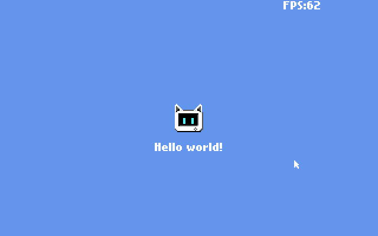
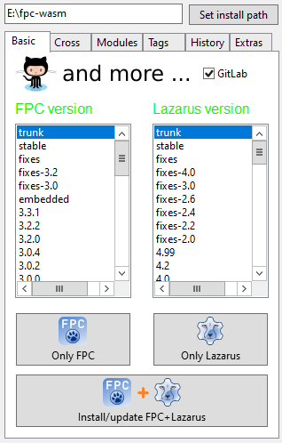
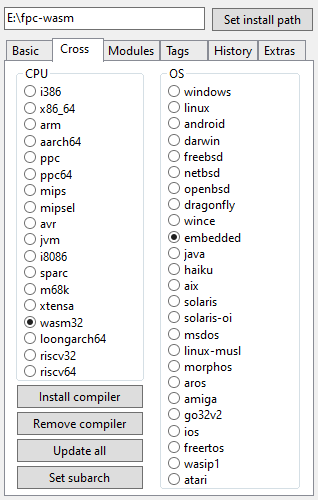

#

This project is a port of the original [POSIT-92](https://github.com/Hevanafa/POSIT-92) for DOS, which targets WebAssembly

## Requirements

1. **Lazarus IDE**
2. **Free Pascal Compiler** which has been configured with `wasm32-embedded` as the target (read **Compiler Setup** section below to see how)
3. **Perl** to handle most of the build & text processing tasks
4. **[Bun](https://bun.com/)** (at least v1.3.5) either to transpile the engine code or to start the local HTTP server

I'm using Windows 10 Home (64-bit, version 22H2, build 19045.6575) to build this project

If you want to use **VSCode** instead of Lazarus, install the **[OmniPascal](https://marketplace.visualstudio.com/items?itemName=Wosi.omnipascal)** extension by Wosi

## Getting Started

1. Open VSCode terminal `Ctrl + ~`
2. `cd boilerplate`
3. Run `perl .\setup.pl`
4. Run `perl .\make.pl`

   This will make sure that all the units can be compiled & run

When all the steps above is done, you can copy all the files of the `boilerplate` folder to your new project, except for `setup.pl`

Optionally:

1. Run `bun .\server.ts`
2. Open `http://localhost:8008` in your browser to see if the "Hello world!" actually appears

## Boilerplate Overview

`hello_demoscene`

- Starts immediately without an intro

`hello_intro`

- Standard Posit-92 project with an intro / loading sequence

`hello_minimal`

- Smallest possible project

## Compiler Setup

1. Download **fpcupdeluxe-x86_64-win64.exe** from [LongDirtyAnimAlf/fpcupdeluxe](https://github.com/LongDirtyAnimAlf/fpcupdeluxe/releases/)

   The version that I used at the time of writing was **v2.4.0g**

2. Install in `E:\fpc-wasm` or anywhere that's easy to reach
3. Under the **Basic** tab, choose the **trunk** version above the FPC button, install **Only FPC**

   

4. Under the **Cross** tab, choose CPU: **wasm32**, OS: **embedded**, then click **Install compiler**

   

It took me a few retries until the compiler finally completed compiling

## Credits

Default font: [Nokia Cellphone FC](https://www.dafont.com/nokia-cellphone.font)

BMFont format: [AngelCode BMFont](https://www.angelcode.com/products/bmfont/)
